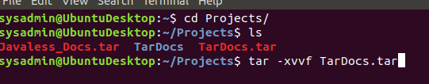

## Archiving and Logging Data
This unit's homework is designed to solidify the following concepts and tools:

Create a tar archive that excludes a directory using the --exclude= command option.
Manage backups using cron jobs.
Write bash scripts to create system resource usage reports.
Perform log filtering using journalctl.
Manage log file sizes using logrotate.
Create an auditing system to check for policy and file violations using auditd.

### Step 1: Create, Extract, Compress, and Manage tar Backup Archives

Command to extract the TarDocs.tar archive to the current directory:

**sudo tar -xvvf TarDocs.tar** 

Command to create the Javaless_Doc.tar archive from the TarDocs/ directory, while excluding the TarDocs/Documents/Java directory:

**sudo tar cvf Javaless_Docs.tar --exclude=”TarDocs/Documents/Java” TarDocs/**

Command to ensure Java/ is not in the new Javaless_Docs.tar archive:

 **tar tvf MyFinancials.tar | grep -i Documents/Java**

 
 
 ### Bonus

Command to create an incremental archive called logs_backup_tar.gz with only changed files to snapshot.file for the /var/log directory:

**sudo tar --listed-incremental=snapshot.file -cvzf logs_backup_tar.gz /var/log**

### Critical Analysis Question

Why wouldn't you use the options -x and -c at the same time with tar?

**you can not create and extract a file at the same time.  you need -c create a back file first and then use -x to extract the files.**  

### Step 2: Create, Manage, and Automate Cron Jobs

Cron job for backing up the /var/log/auth.log file:

**0 6 * * 3 tar -zvf /auth_backup.tar.gz /var/log/auth.log**

### Step 3: Write Basic Bash Scripts

Brace expansion command to create the four subdirectories:

**sudo mkdir {freemem,diskuse,openlist,freedisk}**

Paste your system.sh script edits below:

**#!/bin/bash**
**free -h > ~/backups/freemem/free_mem.txt**
**du -h > ~/backups/diskuse/disk_use.txt**
**lsof > ~/backups/openlist/open_list.txt**
**df -h > ~/backups/freedisk/free_disk.txt**

Command to make the system.sh script executable:

**chmod +x systtem.sh**

### Optional

Commands to test the script and confirm its execution:

 **sudo ./system.sh**

### Bonus

Command to copy system to system-wide cron directory:

**sudo cp system.sh /etc/cron.d**

### Step 4. Manage Log File Sizes

Run sudo nano /etc/logrotate.conf to edit the logrotate configuration file.

Configure a log rotation scheme that backs up authentication messages to the /var/log/auth.log.

Add your config file edits below:

**/var/log/auth.log** {
    **weekly**
    **rotate 7**
    **notifempty**
    **delaycompress**
    **missingok**
    **endscript**
**}**

### Bonus: Check for Policy and File Violations

Command to verify auditd is active:

**sudo systemctl status auditd**

Command to set number of retained logs and maximum log file size:

**sudo nano /etc/audit/auditd.conf**

Command using auditd to set rules for /etc/shadow, /etc/passwd and /var/log/auth.log:

**sudo nano /etc/audit/rules.d/audit.rules**

Add the edits made to the rules file below:

**-w /etc/shadow -p wra -k hashpass_audit**
**-w /etc/passwd -p wra -k userpass_audit**
**-w /var/log/auth.log -p wra -k authlog_audit**

Command to restart auditd:

**sudo systemctl restart auditd**

Command to list all auditd rules:

**sudo auditctl -l**

Command to produce an audit report:

**sudo aureport -au**

Create a user with sudo useradd attacker and produce an audit report that lists account modifications:

**sudo adduser attacker**

Command to use auditd to watch /var/log/cron:

**sudo auditctl -w /var/log/cron**

Command to verify auditd rules:

**sudo auditctl -l**

### Bonus (Research Activity): Perform Various Log Filtering Techniques

Command to return journalctl messages with priorities from emergency to error:

**sudo journalctl -p alert -b**

Command to check the disk usage of the system journal unit since the most recent boot:

**sudo journalctl --disk-usage -b 0**

Comand to remove all archived journal files except the most recent two:

**sudo journalctl --vacuum-files=2**

Command to filter all log messages with priority levels between zero and two, and save output to /home/sysadmin/Priority_High.txt:

**sudo journalctl -p crit >> ~/student/Priority_High.txt**

Command to automate the last command in a daily cronjob. Add the edits made to the crontab file below:

**0 22 * * 1-7 journalctl -p crit >> ~/student/Priority_High.txt**